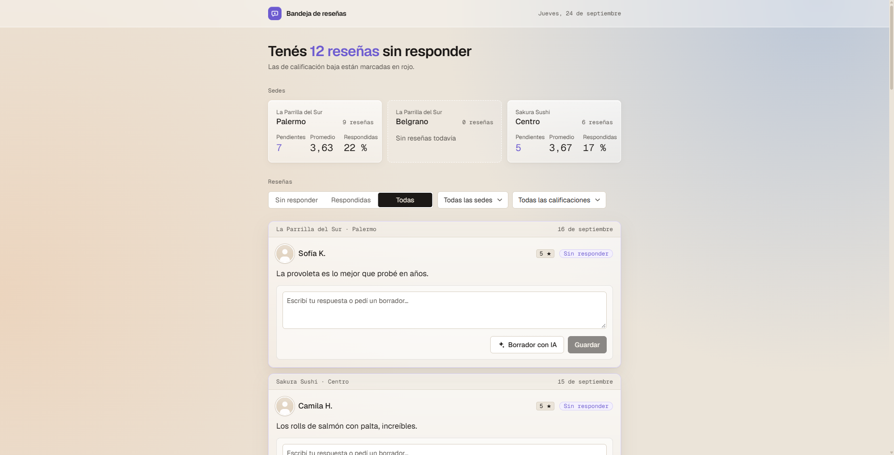
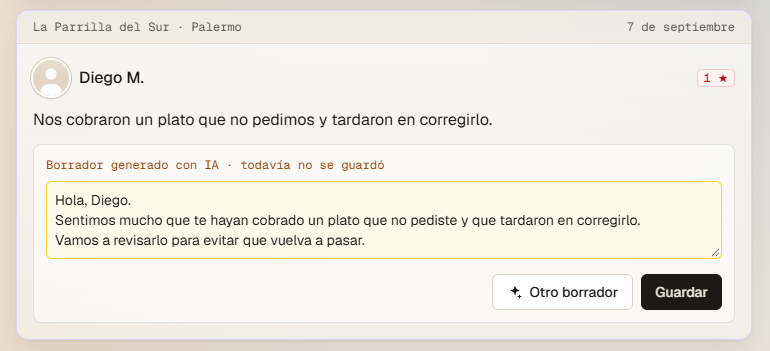
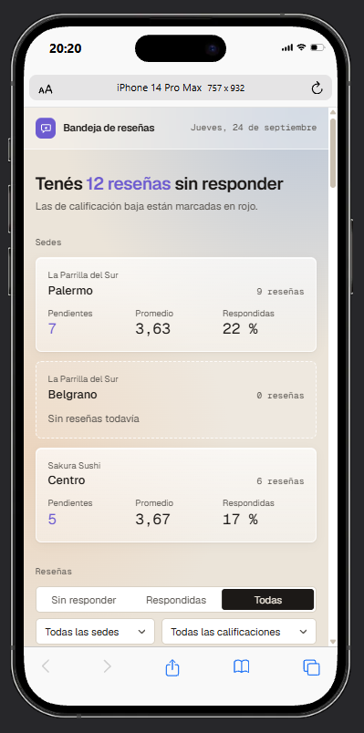

# ReplyApp

Bandeja de reseñas para un grupo gastronómico con dos restaurantes y tres sedes. Importa las reseñas desde un archivo, muestra qué falta responder, genera un borrador con IA que la persona edita antes de guardar y resume cada sede.

**Demo:** https://replyapplication.vercel.app



## Stack

Next.js 16 con TypeScript y Tailwind, Supabase, Groq para los borradores, Vitest para los tests y Vercel para el deploy.

## Levantarlo desde cero

Requisitos: Node 22 o superior y un proyecto en Supabase.

1. Correr `supabase/schema.sql` en el **SQL Editor** de Supabase.
2. En la terminal:

```bash
npm install
cp .env.example .env.local   # en Windows: copy .env.example .env.local, y completar los valores
npm run import
npm run dev
```

La app queda en http://localhost:3000. Los tests se corren con `npm test`.

## Variables de entorno

| Variable | Para qué sirve | Dónde se consigue |
| --- | --- | --- |
| `SUPABASE_URL` | URL del proyecto | Supabase → Project Settings → Data API |
| `SUPABASE_SECRET_KEY` | Llave secreta de la base. Solo se usa en el servidor | Supabase → Project Settings → API Keys |
| `GROQ_API_KEY` | Llave para generar borradores. Opcional | console.groq.com → API Keys |

Las llaves nunca llegan al navegador: todo pasa por el servidor. Sin `GROQ_API_KEY`, la app funciona igual y el botón de borrador avisa que la IA no está disponible.

## Decisiones sobre los datos

| Caso | Qué hace la app | Por qué |
| --- | --- | --- |
| **rv-205 duplicada** | Queda la versión más nueva (3 estrellas) | Es la edición posterior del mismo cliente |
| **rv-108 sin calificación** | Cuenta en el total de la sede, pero no en el promedio. Dice "Sin calificación" | Hay que responderla, pero no tiene un número para promediar |
| **rv-105 sin texto** | Se guarda igual y dice "Sin comentario" | Una calificación sola también merece respuesta |
| **rv-301, sede inexistente** | No se importa, y la importación avisa cuál salteó y por qué | Inventar una sede ensuciaría el resumen |
| **Belgrano sin reseñas** | Muestra "Sin reseñas todavía" en vez de un promedio | Un promedio de 0 sería falso |
| **Reseñas ya respondidas** | Entran como respondidas, con su texto y su fecha | Son respuestas reales |

La importación se puede correr muchas veces sin duplicar nada, y nunca pisa una respuesta guardada desde la app.

## Decisiones de diseño

- **Pensada para la rutina de la mañana.** Por defecto muestra lo que falta responder, y el titular y la pestaña del navegador dicen cuántas quedan.
- **Cada color tiene un solo significado:** rojo para calificaciones bajas, ámbar para borradores sin guardar, verde para guardado y violeta para lo pendiente. El resto son neutros.
- **El borrador se nota como borrador:** el campo se pone ámbar y dice *Borrador generado con IA · todavía no se guardó*.
- **El tono del borrador depende de la calificación:** disculpas para 1 y 2 estrellas, agradecimiento para 4 y 5.
- **Los filtros quedan en la URL**, así un link filtrado se puede compartir.
- **La tarjeta no repite lo que el filtro ya dice:** filtrando por sede, la sede desaparece de cada tarjeta.

## Qué no llegué a hacer

- **Ordenar por urgencia**, con las reseñas de 1 y 2 estrellas sin responder arriba.
- **Editar una respuesta ya guardada.**
- **Mostrar quién escribió cada respuesta:** la IA, la IA editada o una persona.
- **Un tono distinto para cada restaurante** en los borradores.
- **Modo oscuro.**

## Capturas

| Borrador con IA | Celular |
| --- | --- |
|  |  |